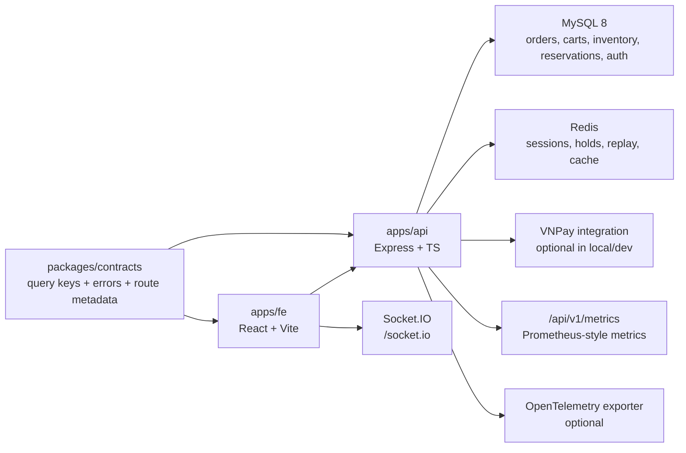

# PROJECT_SNAPSHOT_SPEC.md

_Snapshot date:_ 2026-03-20  
_Snapshot scope:_ current repository state after PR25 rescue, post-PR25 hardening, and latest customer session recovery fix  
_Audience:_ maintainers, reviewers, handover owners, onboarding developers

---

## 1) Purpose

This document is the current-state snapshot of the Hadilao Online monorepo.

It is intended to answer, in one place:

- what is in the repo right now
- how the system is structured
- which API modules exist
- which frontend feature modules exist
- what the current business/source-of-truth rules are
- how the system is configured, verified, and operated locally
- what is still intentionally out of scope or not safe to overclaim

This document is a curated snapshot, not an exhaustive generated route dump.  
For the full route inventory, use [../API_ROUTE_MAP.generated.md](../API_ROUTE_MAP.generated.md).

---

## 2) Current Project Status

Current technical judgment:

- The repo is now coherent for local demo, handover, and structured verification.
- Inventory commit logic is aligned with order commit, not delayed until `PREPARING`.
- Customer and internal stock visibility are materially improved versus the pre-hardening state.
- FE now recovers from stale/closed customer table sessions instead of leaving the customer stuck on cart creation.
- The project is still **not** a full enterprise production deployment package and should not be represented that way.

Current recommended positioning:

- **Safe claim:** strong local-demo / handover-safe / technically coherent
- **Do not claim:** production-ready enterprise closeout, public branch-wide realtime full-spec

Reference companions:

- [FINAL_STATUS.md](./FINAL_STATUS.md)
- [KNOWN_ISSUES.md](./KNOWN_ISSUES.md)
- [SOURCE_OF_TRUTH.md](./SOURCE_OF_TRUTH.md)

---

## 3) Workspace Inventory

The repository is a `pnpm workspace` monorepo with 3 primary code workspaces:

| Workspace | Path | Role |
|---|---|---|
| Backend API | `apps/api` | Express API, business orchestration, MySQL + Redis integration, realtime, maintenance, smoke verification |
| Frontend App | `apps/fe` | React customer + internal UI, route guards, TanStack Query, Zustand, realtime client |
| Shared Contracts | `packages/contracts` | Shared query keys, error model, route/permission metadata, realtime protocol types |

Root operational docs and specs:

| File | Purpose |
|---|---|
| `README.md` | quickstart, stack, verify commands, high-level source of truth |
| `BE_SPEC.md` | backend contract summary |
| `CONTRACT_RULES.md` | contract lock and implementation guardrails |
| `RBAC_MATRIX.md` | roles, permissions, page/action mapping |
| `docs/API_ROUTE_MAP.generated.md` | generated canonical API route map |
| `docs/final/*` | final status, source-of-truth, handover, known issues |

---

## 4) Runtime Topology



Primary data responsibilities:

- MySQL is the system of record for orders, inventory items, reservations, menu projections, staff/auth records, and most operational entities.
- Redis is used for ephemeral/session-oriented behavior: stock holds, session store, realtime replay, and optional menu cache.
- Socket.IO is used for realtime invalidation/replay/resync behavior.

---

## 5) Technical Baseline

### 5.1 Monorepo and build

| Area | Current baseline |
|---|---|
| Package manager | `pnpm@10.4.1` |
| Workspace model | `pnpm-workspace.yaml` (`apps/api`, `apps/fe`, `packages/*`) |
| Root verify scripts | `verify:static`, `verify:smokes`, `verify:all` |
| Backend dev runner | `tsx watch` |
| Frontend dev runner | `vite` |

### 5.2 Backend stack

| Layer | Technology |
|---|---|
| HTTP server | Express 4 |
| Language | TypeScript |
| Database client | `mysql2` |
| Cache / ephemeral state | `redis` |
| Realtime | `socket.io` + optional Redis adapter |
| Validation | `zod` |
| Logging | `morgan` + internal logging/env controls |
| Observability | Prometheus-style metrics + optional OpenTelemetry |

### 5.3 Frontend stack

| Layer | Technology |
|---|---|
| UI framework | React 19 |
| Router | `react-router-dom` 7 |
| Data fetching | TanStack Query 5 |
| Client state | Zustand 5 |
| Build tool | `rolldown-vite@7.2.5` (via Vite alias) |
| Styling | Tailwind CSS |
| Realtime client | `socket.io-client` |

### 5.4 Shared contracts package

`packages/contracts` currently exposes:

- query key helpers
- normalized API error primitives
- route manifest / permission metadata
- realtime protocol types
- schema skeletons for gradual stricter validation

This package is the intended contract anchor between FE and API.

---

## 6) Backend Architecture Snapshot

### 6.1 Layering model

The backend currently follows a layered architecture:

| Layer | Path | Responsibility |
|---|---|---|
| Application | `apps/api/src/application` | use cases, orchestration, ports, business workflows |
| Domain | `apps/api/src/domain` | domain types and rules |
| Infrastructure | `apps/api/src/infrastructure` | MySQL, Redis, config, services, repositories |
| Interface adapters | `apps/api/src/interface-adapters` | HTTP routes/controllers and transport mapping |
| Main | `apps/api/src/main` | DI composition, startup, runtime wiring |

Current use-case families under `application/use-cases`:

- `admin`
- `auth`
- `cart`
- `maintenance`
- `menu`
- `order`
- `payment`
- `reservation`
- `table`

### 6.2 API contract posture

Current route policy:

- Canonical API surface is `/api/v1/*`
- Legacy `/api/*` mirrors are disabled by default
- Legacy mirror is only available when `LEGACY_API_ENABLED=true`
- Contract lock matters: when legacy is disabled, `/api/*` should 404

Always-on non-domain endpoints:

- `GET /api/v1/health`
- `GET /api/v1/metrics` when metrics are enabled

---

## 7) Backend API Module Inventory

### 7.1 Public / customer-facing API modules

| Module | Route family | Responsibility | Representative endpoints |
|---|---|---|---|
| Client Auth | `/api/v1/client/*` | OTP request/verify, refresh rotation, logout | `POST /client/otp/request`, `POST /client/otp/verify`, `POST /client/refresh`, `POST /client/logout` |
| Tables | `/api/v1/tables*` | Table lookup and direction/table discovery | `GET /tables`, `GET /tables/:directionId` |
| Table Sessions | `/api/v1/sessions*` | Open/close customer table session | `POST /sessions/open`, `POST /sessions/:sessionKey/close` |
| Carts | `/api/v1/carts*` | Session cart open/get/update/delete | `POST /carts/session/:sessionKey`, `GET /carts/:cartKey`, `PUT /carts/:cartKey/items`, `DELETE /carts/:cartKey/items/:itemId` |
| Orders | `/api/v1/orders*` | Create order from cart and read status | `POST /orders/from-cart/:cartKey`, `GET /orders/:orderCode/status` |
| Payments | `/api/v1/payments*` | VNPay create/return/IPN | `POST /payments/vnpay/create/:orderCode`, `GET /payments/vnpay/return`, `GET /payments/vnpay/ipn` |
| Reservations | `/api/v1/reservations*` | Public reservation creation, detail, cancel, availability | `POST /reservations`, `GET /reservations/availability`, `GET /reservations/:reservationCode`, `POST /reservations/:reservationCode/cancel` |
| Menu | `/api/v1/menu*` | Public menu and item detail projection | `GET /menu/categories`, `GET /menu/items`, `GET /menu/items/:itemId`, combo/meat-profile subroutes |
| Realtime Support | `/api/v1/realtime*` | Snapshot and resync support for realtime clients | `GET /realtime/snapshot`, `POST /realtime/resync` |

### 7.2 Internal/admin API modules

| Module | Route family | Responsibility | Representative endpoints |
|---|---|---|---|
| Admin Auth | `/api/v1/admin/login` | Internal login bootstrap | `POST /admin/login` |
| Admin Menu | `/api/v1/admin/menu*` | Categories, menu items, active flag, recipes | `GET /admin/menu/items`, `POST /admin/menu/items`, `PUT /admin/menu/items/:itemId`, `GET/PUT /admin/menu/items/:itemId/recipe` |
| Admin Staff | `/api/v1/admin/staff*` | Staff list/create/role/status/reset-password | `GET /admin/staff`, `POST /admin/staff`, `PATCH /admin/staff/:staffId/role` |
| Admin Inventory | `/api/v1/admin/inventory*` | Inventory stock, items, holds, alerts, adjustments, rehydrate, sellable bump | `GET /admin/inventory/stock`, `POST /admin/inventory/stock/adjust`, `GET /admin/inventory/holds`, `GET /admin/inventory/items`, `POST /admin/inventory/menu/bump` |
| Admin Ops | `/api/v1/admin/ops*` | Internal tables/sessions/carts/orders on behalf of operations staff | `GET /admin/ops/tables`, `POST /admin/ops/sessions/open`, `POST /admin/ops/orders/from-cart/:cartKey` |
| Admin Kitchen | `/api/v1/admin/kitchen*` | Kitchen queue read model | `GET /admin/kitchen/queue` |
| Admin Cashier | `/api/v1/admin/cashier*` | Unpaid orders and cash settlement | `GET /admin/cashier/unpaid`, `POST /admin/cashier/settle-cash/:orderCode` |
| Admin Orders | `/api/v1/admin/orders*` | Order status transition | `POST /admin/orders/:orderCode/status` |
| Admin Reservations | `/api/v1/admin/reservations*` | Reservation read/confirm/checkin | `GET /admin/reservations`, `PATCH /admin/reservations/:reservationCode/confirm`, `POST /admin/reservations/:reservationCode/checkin` |
| Admin Maintenance | `/api/v1/admin/maintenance*` | Dev reset tools and maintenance jobs | `POST /admin/maintenance/reset-dev-state`, `POST /admin/maintenance/run`, `POST /admin/maintenance/sync-table-status` |
| Admin Observability | `/api/v1/admin/observability*` | Logs and slow query surfaces | `GET /admin/observability/logs`, `GET /admin/observability/slow-queries` |
| Admin Realtime | `/api/v1/admin/realtime*` | Realtime audit and replay inspection | `GET /admin/realtime/audit`, `GET /admin/realtime/replay` |
| Admin Payment | `/api/v1/admin/payments*` | Mock payment success tooling | `POST /admin/payments/mock-success/:orderCode` |

### 7.3 API module notes

- Full exact route listing lives in [../API_ROUTE_MAP.generated.md](../API_ROUTE_MAP.generated.md).
- Permission mapping is aligned through shared route permission metadata plus backend enforcement.
- Admin menu/admin realtime route scoping has been hardened so route-level permission middleware no longer blocks unrelated `/admin/*` families by mistake.

---

## 8) Frontend Application Snapshot

### 8.1 Routing model

The frontend exposes 3 primary route spaces:

| Route space | Purpose |
|---|---|
| `/` | app entry / redirect shell |
| `/c/*` | customer table-ordering and public reservation flow |
| `/i/*` | internal staff/admin experience |

Customer routes are session-driven.  
Internal routes are auth-driven and branch-scoped.

### 8.2 Customer feature modules

| Feature module | Current FE paths | Responsibility |
|---|---|---|
| QR / Session Open | `/c/qr`, `/c/session/:sessionKey` | Open table session from QR or table code, bootstrap session into store |
| Menu | `/c/menu` | Browse public menu projection, availability, cart-aware CTA |
| Cart | `/c/cart` | Review cart and edit quantities |
| Checkout / Order | `/c/checkout`, `/c/orders/:orderCode` | Create order from cart, track order status |
| Payment | `/c/payment/:orderCode`, `/c/payment/return` | VNPay flow and return state |
| Reservations | `/c/reservations`, `/c/reservations/:reservationCode` | Public reservation entry/detail flow |

Current customer UX/state characteristics:

- Customer table ordering is guarded by a local customer session store.
- Session stale/closed recovery is now hardened: stale `SESSION_CLOSED` or `SESSION_NOT_FOUND` states clear the stale session and send the customer back to `/c/qr` with a recovery message.
- Pending add-to-cart intent can be preserved across session recovery/open-table re-entry.

### 8.3 Internal feature modules

| Feature module | Current FE paths | Responsibility |
|---|---|---|
| Internal Auth | `/i/login`, `/i/logout` | Staff/admin login and logout |
| Dashboard | `/i/:branchId/admin/dashboard` | Admin overview landing page |
| Tables / Ops | `/i/:branchId/tables`, `/i/:branchId/admin/tables` | Table/session/ops operations |
| POS | `/i/:branchId/pos/menu` | Internal POS menu flow |
| Kitchen | `/i/:branchId/kitchen`, `/i/:branchId/admin/kitchen` | Kitchen queue and status progression |
| Cashier | `/i/:branchId/cashier`, `/i/:branchId/admin/cashier` | Unpaid orders and settlement |
| Inventory | `/i/:branchId/inventory/*`, `/i/:branchId/admin/inventory/*` | Stock, holds, adjustments, items, alerts, recipes |
| Menu Management | `/i/:branchId/admin/menu` | Menu item/category/recipe management |
| Reservations | `/i/:branchId/reservations`, `/i/:branchId/admin/reservations` | Internal reservation workflow |
| Staff Admin | `/i/:branchId/admin/staff` | Staff management |
| Maintenance | `/i/:branchId/maintenance`, `/i/:branchId/admin/maintenance` | Dev/reset/maintenance tasks |
| Observability | `/i/:branchId/admin/observability` | Logs and slow query surfaces |
| Realtime Admin | `/i/:branchId/admin/realtime` | Realtime audit/replay tools |

### 8.4 FE shared technical patterns

| Concern | Current pattern |
|---|---|
| Server state | TanStack Query with shared query keys from `@hadilao/contracts` |
| Client state | Zustand stores for internal auth and customer session |
| API transport | `apiFetch` + normalized `HttpError` model |
| Route guard | internal auth guards + customer session guard |
| Realtime | shared realtime manager + room join/invalidation logic |
| Persistence | browser storage for auth/session and selected ephemeral workflows |

---

## 9) Shared Contracts Snapshot

`packages/contracts` is the current cross-layer contract package.

Current exported contract surfaces:

| Export area | Purpose |
|---|---|
| `queryKeys` | stable TanStack Query key naming |
| `errors/*` | normalized API error shape and error codes |
| `Schemas` | schema skeletons for gradual validation hardening |
| `route-manifest` | route metadata support |
| `route-permissions` | permission metadata by route |
| `realtime-protocol` | event payload / replay / resync contract types |

Practical role in the repo today:

- FE uses shared query keys and error normalization expectations.
- API and docs use shared metadata to reduce contract drift.
- This package is part of the repo's anti-drift strategy, even though not all response bodies are yet fully schema-validated end-to-end.

---

## 10) Core Domain and Business Rules

This is the current source-of-truth summary. For the detailed version, use [SOURCE_OF_TRUTH.md](./SOURCE_OF_TRUTH.md).

### 10.1 Session and cart

- Customer ordering is anchored to a table session.
- Cart operations require a valid open session and a branch context.
- Cart `+ / -` does **not** consume real ingredient inventory.
- Cart quantity changes operate as hold/release behavior against sellable capacity.

### 10.2 Order commit point

Current rule:

> `CreateOrderFromCart` is the inventory commit point.

At successful order creation, the backend now:

- locks/validates the cart
- creates the order
- inserts order items
- consumes the Redis/MySQL hold pathway
- deducts ingredient inventory immediately
- writes `inventory_consumptions`
- recomputes or syncs sellable stock projections

### 10.3 `PREPARING` status

`PREPARING` is no longer the primary inventory deduction point.

Current behavior:

- order status transition remains a kitchen/operational state
- new orders already consumed at checkout must not deduct again
- legacy-safe logic remains to avoid breaking older flows/data assumptions

### 10.4 Cancel / restock

Current cancellation compensation rule:

- cancel at `NEW` or `RECEIVED` -> ingredient restock occurs
- consumption marker is updated to a restocked variant
- sellable stock is recomputed/synced
- cancel after `PREPARING` -> no automatic restock today

### 10.5 Sellable stock and visibility

Current interpretation:

- `inventory_items.current_qty` is the ingredient inventory source of truth
- Redis holds represent temporary reservations
- MySQL `menu_item_stock` is a sellable/projected stock layer, not the raw ingredient truth
- admin stock UI now separates `DB qty`, `Reserved`, and `Available`

### 10.6 Customer stale session recovery

Current behavior:

- if FE hits `SESSION_CLOSED` or `SESSION_NOT_FOUND` while loading cart/order-related flows
- the stale customer session is cleared
- the customer is redirected back into the open-table journey
- the QR/open-table page can explain the recovery reason
- pending add-to-cart intent can be preserved through re-entry

---

## 11) Data and Integration Surfaces

### 11.1 Primary data stores

| Store | Current use |
|---|---|
| MySQL | orders, order items, reservations, menu, recipes, inventory items, consumptions, staff/auth, table/session canonical records |
| Redis | customer session store, stock holds, replay log, optional menu cache, optional socket adapter backing |

### 11.2 Realtime

Current realtime stack:

- Socket.IO transport
- optional Redis adapter for multi-instance fanout
- replay log / gap recovery support
- snapshot/resync HTTP support
- internal/admin audit and replay surfaces

Current limitation:

- public/customer stock is still not a fully hardened branch-wide realtime public room model
- FE uses improved invalidation plus polling fallback where necessary

### 11.3 External integration

| Integration | Current role |
|---|---|
| VNPay | payment create/return/IPN flow |
| OpenTelemetry | optional trace export when enabled |
| Prometheus-style metrics | `/api/v1/metrics` when enabled |

---

## 12) Security, Authorization, and Robustness

### 12.1 Role model

Current personas in the repo:

- `PUBLIC`
- `CLIENT`
- `ADMIN`
- `BRANCH_MANAGER`
- `STAFF`
- `KITCHEN`
- `CASHIER`

Reference:

- [../../RBAC_MATRIX.md](../../RBAC_MATRIX.md)

### 12.2 Authorization posture

Current model:

- internal pages are guarded by auth and role/permission expectations
- backend remains the final permission authority
- permission naming follows `domain.resource.action` conventions
- shared route permission metadata exists in `packages/contracts`

### 12.3 Idempotency and anti-double-effect protections

Sensitive operations are expected to be at-most-once in effect:

- create order from cart
- cashier settle cash
- mock payment success
- payment duplicate/retry scenarios

The repo currently includes explicit hardening in these areas to avoid:

- duplicate order creation
- duplicate hold consumption
- duplicate ingredient deduction
- duplicate settlement

### 12.4 Rate limiting and dev auth controls

Runtime config supports:

- OTP request/verify rate limits
- admin login rate limits
- dev OTP echo/fixed code mode
- token-based internal auth
- client access/refresh token lifecycle

---

## 13) Operational and Environment Spec

### 13.1 Local prerequisites

Required local services:

- Node.js 22.x
- pnpm 10.x
- MySQL 8
- Redis

Default local ports:

| Service | Default |
|---|---|
| FE | `http://localhost:5173` |
| API | `http://localhost:3001` |
| MySQL | `127.0.0.1:3306` |
| Redis | `127.0.0.1:6379` |

### 13.2 Important runtime config groups

`apps/api/.env.example` currently defines grouped config for:

- contract lock
- observability and metrics
- idempotency
- OpenTelemetry
- MySQL
- Redis / realtime
- replay and resync
- Redis session store
- Redis stock holds
- stock rehydrate
- menu cache
- OTP / refresh tokens
- admin auth
- VNPay
- reservation rules
- maintenance jobs
- dev reset tools

### 13.3 Local bootstrap

Standard local bootstrap:

```powershell
pnpm install
Copy-Item apps/api/.env.example apps/api/.env
pnpm -C apps/api db:reset --yes
pnpm -C apps/api seed:internal
pnpm -C apps/api dev
pnpm -C apps/fe dev
```

Runbook:

- [../../apps/api/docs/RUNBOOK.md](../../apps/api/docs/RUNBOOK.md)

---

## 14) Verification Surfaces

### 14.1 Root-level gates

| Command | Purpose |
|---|---|
| `pnpm verify:static` | contracts build + FE lint/typecheck/build + API typecheck/build |
| `pnpm verify:smokes` | full smoke pack suite |
| `pnpm verify:all` | static + smoke |

### 14.2 API smoke packs

| Command | Purpose |
|---|---|
| `pnpm -C apps/api smoke` | core flow |
| `pnpm -C apps/api smoke:full` | customer + internal 7 roles + inventory + ops |
| `pnpm -C apps/api smoke:negative` | negative, forbidden, idempotency, branch isolation |
| `pnpm -C apps/api smoke:realtime` | replay/join/gap sanity |
| `pnpm -C apps/api smoke:oversell` | deterministic concurrency guard |
| `pnpm -C apps/api verify:smokes` | all smoke packs |

Smoke guide:

- [../../apps/api/postman/README_SMOKE.md](../../apps/api/postman/README_SMOKE.md)

### 14.3 Current verification posture

Current project docs state that the repo has passed:

- FE lint/typecheck/build
- API typecheck/build
- full smoke / negative / realtime / oversell packs

The canonical status statement for this belongs in:

- [FINAL_STATUS.md](./FINAL_STATUS.md)

---

## 15) Known Limits and Non-Claims

This repo still has explicit limits that should be spoken about honestly.

Current non-closed or intentionally constrained areas include:

- customer/public stock now has a public-safe branch realtime room for inventory/menu updates, but still keeps polling fallback and should not be overclaimed as full-spec enterprise realtime
- public reservation FE now supports create/detail/cancel with clearer hold/check-in window visibility, but still has remaining UX polish headroom
- branch `999` is intentionally used as an isolation fixture branch in testing strategy, not as a main business demo branch
- local environment discipline still matters for deterministic demo quality

Reference:

- [KNOWN_ISSUES.md](./KNOWN_ISSUES.md)

What should not be claimed:

- enterprise production readiness
- full public realtime stock closeout
- all deferred roadmap work completed
- no dependency on local MySQL/Redis state

---

## 16) Recommended Companion Docs

For someone inheriting or reviewing the project, the best reading order is:

1. [../../README.md](../../README.md)
2. [./SOURCE_OF_TRUTH.md](./SOURCE_OF_TRUTH.md)
3. [./FINAL_STATUS.md](./FINAL_STATUS.md)
4. [./KNOWN_ISSUES.md](./KNOWN_ISSUES.md)
5. [../../apps/api/docs/RUNBOOK.md](../../apps/api/docs/RUNBOOK.md)
6. [../API_ROUTE_MAP.generated.md](../API_ROUTE_MAP.generated.md)
7. [../../RBAC_MATRIX.md](../../RBAC_MATRIX.md)

---

## 17) Bottom Line

The current Hadilao Online repository is a structured monorepo with:

- a layered TypeScript backend
- a React customer/internal frontend
- a shared contracts package
- coherent order/inventory commit rules
- deterministic smoke verification surfaces
- clearer stock/session visibility than before hardening

It is strong enough for serious local demo, technical review, and handover.
It is not yet a full production-grade closeout, and the repo documentation now intentionally says that clearly.
